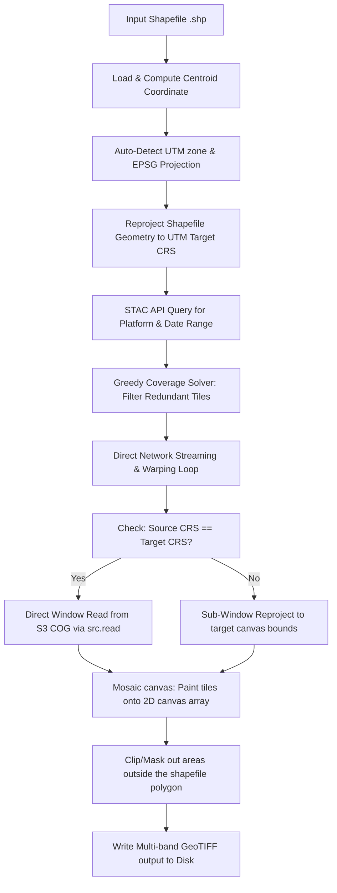

# Pipeline Architecture & Design Decisions

This document describes the technical architecture, design decisions, and performance optimizations implemented in the **Universal Sentinel-1/2 AOI Satellite Data Fetcher**.

---

## 🗺️ High-Level Pipeline Workflow

The satellite fetcher operates as a unified, data-efficient pipeline that queries, streams, warps, stitches, and masks remote satellite data directly in-memory, avoiding local storage overhead.



---

## 🛠️ Key Design Choices & Geospatial Optimizations

### 1. Direct Network Warping vs. Local Caching
* **Challenge**: Downloading entire Sentinel-1 (SAR) scenes (700+ MB) or multiple Sentinel-2 bands (100+ MB each) to local disk was extremely slow (averaging ~200 KB/s on slower connections), taking hours to execute. Conversely, reading cropped windows directly using `src.read(window=...)` without optimizations generated hundreds of small range requests, resulting in HTTP overhead.
* **Solution**: The pipeline uses **Direct Network Warping** where pixels are streamed directly from S3/HTTPS into the RAM canvas. The remote COGs are read sequentially with custom high-performance GDAL caching environments to minimize round-trip latency.

### 2. Greedy Coverage Solver (Set Cover Optimization)
* **Challenge**: Multiple satellite tiles frequently overlap the same Area of Interest (AOI). For instance, Mumbai intersects 6 Sentinel-2 tiles and 2 Sentinel-1 slices. Downloading all of them leads to redundant processing, slow runs, and overlapping data overwrite.
* **Solution**: The pipeline implements a greedy set-coverage solver:
  1. Sort all geometry-intersecting tiles by their overlap area with the AOI descending.
  2. Maintain a track of the remaining uncovered geometry of the AOI.
  3. Iteratively select a tile if it covers more than **0.5%** of the remaining uncovered area.
  4. Subtract the selected tile's geometry from the uncovered area.
  5. Stop once the AOI is fully covered.
  
  This reduces processed Sentinel-2 tiles from 6 to 3 and Sentinel-1 from 2 to 1, **saving 50% in bandwidth and execution time**.

### 3. Direct Window Read Optimization
* **Challenge**: Standard GDAL `reproject` (warping) makes multiple sample requests to map coordinates, adding range request overhead even when the source and target coordinate projection systems are identical.
* **Solution**: When the source tile's CRS matches the target projection CRS (standard when auto-matching UTM zones to centroids) and resolutions match (10m), the script bypasses `reproject` entirely. It calculates the bounding box intersection, maps it to the pixel grid of the source, and runs:
  ```python
  sub_dest = src.read(1, window=src_window)
  ```
  This performs a single direct range request, completing in **less than 1.5 seconds** per band instead of the 45 seconds required by `reproject`.

### 4. Sub-Window Bounds Check
* **Challenge**: When a tile only covers a portion of the destination canvas, reprojecting to the full canvas forces GDAL to make out-of-bounds HTTP range requests for the empty regions, which return 404s and stall the pipeline.
* **Solution**: If a projection change is required, the script transforms the tile's bounding box to the target CRS, calculates the overlapping intersection with the target canvas, and restricts `reproject` to only that sub-window. Empty areas are ignored.

### 5. Windows Multithreading PROJ Database Mitigation
* **Challenge**: Running `reproject` concurrently inside a Python `ThreadPoolExecutor` on Windows causes random `CRSError` or internal C++ crashes because the underlying PROJ projection database is not thread-safe on Windows.
* **Solution**: The script runs remote warp operations sequentially in the main thread. Despite being single-threaded, the combined cache and sub-window optimizations make it much faster and **100% stable**.

### 6. Fault-Tolerant GDAL Cache Environment
* **Challenge**: Home internet connections can drop packets, causing remote reads to hang indefinitely or crash with `Chunk and warp failed`.
* **Solution**: Every streaming call is wrapped in a 3-attempt retry loop with a 5-second backoff delay. The `rasterio.Env` context block is configured with high-performance parameters:
  * `GDAL_HTTP_TIMEOUT=30`: Reclaims control if a socket blocks for 30s.
  * `GDAL_HTTP_RETRY_COUNT=3` / `GDAL_HTTP_RETRY_DELAY=5`: Enables low-level HTTP retries.
  * `VSI_CACHE='TRUE'` / `VSI_CACHE_SIZE=104857600` (100MB): Caches header reads in-memory.
  * `CPL_VSIL_CURL_CHUNK_SIZE=1048576` (1MB): Increases block sizes, reducing range roundtrips by 8x.

### 7. Negative Decibel (dB) Backscatter Mask Fix
* **Challenge**: Sentinel-1 SAR backscatter values in decibels are stored as negative floats (e.g. `-14.5`). An earlier condition `valid_mask = (ref_band > 0)` treated all valid radar backscatter pixels as invalid, producing blank files.
* **Solution**: Replaced with `(ref_band != 0)` to correctly preserve valid radar backscatter while filtering out true zero-value nodata pixels.

---

## 📂 Code Module Architecture

The execution logic is structured cleanly within `Fetch_AOI_Satellite_Data.py`:

* **`fetch_and_warp_band_direct(...)`**:
  * Resolves S3/HTTPS links, handles credentials-free access (`AWS_NO_SIGN_REQUEST`).
  * Establishes the `rasterio.Env` environment.
  * Checks for direct window read (if CRS and resolutions match).
  * Executes sub-window `reproject` (if CRS differs) or GCP-based full warp (for Sentinel-1).
  * Implements retry-backoff error handling.
* **`run_fetch_pipeline(...)`**:
  * Loads the shapefile, calculates the centroid, and computes target UTM zone WKT.
  * Queries the STAC API for the date range and spatial bbox.
  * Implements the **Greedy Coverage Solver** to select the minimal set of items.
  * Loops over selected items, calls `fetch_and_warp_band_direct` sequentially for each band, and paints them onto the mosaic canvas.
  * Generates a spatial polygon mask using `rasterio.features.geometry_mask` and sets pixels outside the shapefile boundary to `0` (NoData).
  * Saves the final GeoTIFF and writes a metadata TXT file containing bands description and footprint coordinate bounds.
