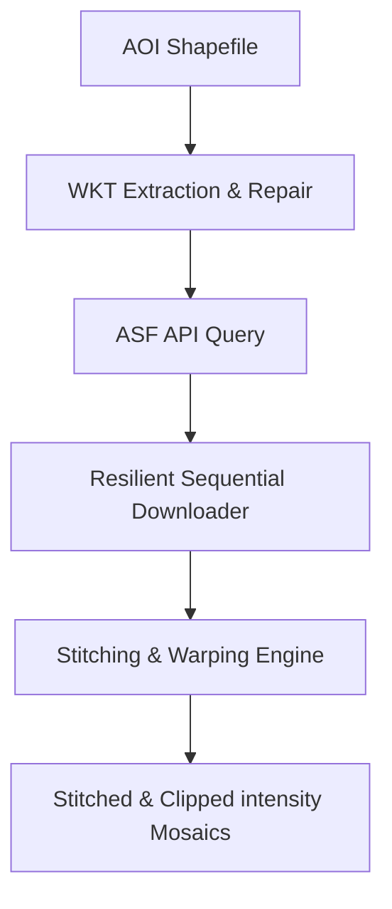

# Sentinel-1 SLC Processing Architecture

This document describes the high-level architecture and data processing workflow implemented in the Sentinel-1 SLC downloader and processor.

---

## 🏗️ System Components

The pipeline consists of a single entry-point script `SLC/download_SLC_image.py` that handles the entire search, download, and processing lifecycle:

---

## 🔄 High-Level Data Flow

1. **Boundary Pre-processing**:
   * The shapefile is loaded and unified into a single polygon.
   * The coordinates are reprojected to **WGS84 (EPSG:4326)** to query the NASA/ASF catalog.
2. **Search & Filtration**:
   * The catalog is queried for `BURST` level products overlapping the AOI.
   * Size and acquisition metadata are displayed.
3. **Resilient Download Engine**:
   * Authenticates against NASA Earthdata Login.
   * Downloads files sequentially with auto-skipping for already-completed downloads.
   * Automatically retries temporary server-side network errors (like HTTP 503/404) up to 3 times before moving on.
4. **Warping & Resampling Engine**:
   * For each burst, the script reads **Band 1 (complex64)**.
   * Amplitude is calculated: $|S| = \sqrt{\text{Real}^2 + \text{Imaginary}^2}$.
   * Using the **Ground Control Points (GCPs)** embedded in the source SLC metadata, the script warps the amplitude array to the target **UTM Zone 43N (EPSG:32643)** projection at **10-meter spatial resolution** using bilinear resampling.
5. **Stitching & Masking Engine**:
   * Overlapping pixels from multiple bursts are averaged to prevent bright boundary seams.
   * A binary mask is generated by rasterizing the shapefile geometry on the target grid.
   * The final stitched grid is masked exactly to the shapefile boundaries.
   * Outputs are saved with LZW compression and tiling.

---

## 🛠️ Spatial Processing Parameters

* **Target CRS**: `EPSG:32643` (WGS 84 / UTM zone 43N)
* **Pixel Resolution**: `10.0m`
* **Output Format**: GeoTIFF (tiled, LZW compressed, Single-Band Float32)
* **NoData Value**: `0.0`
